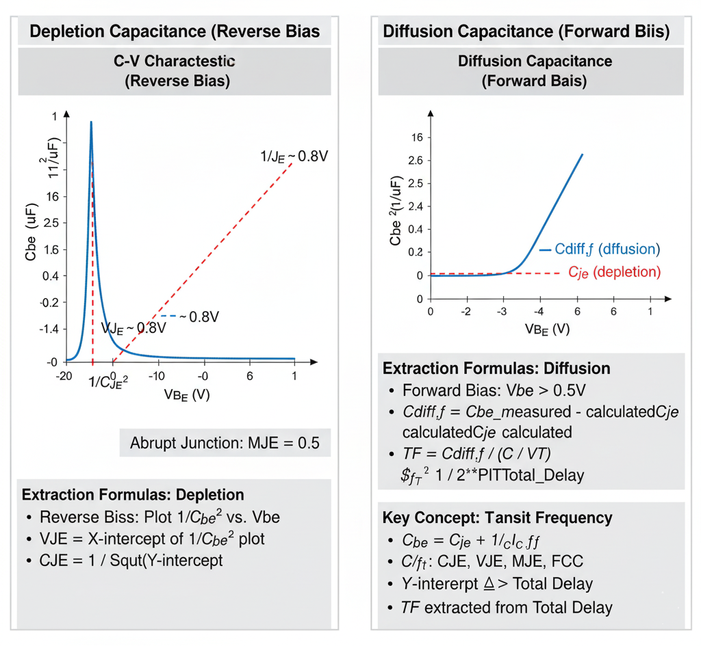

## Theory
**Introduction:**  
BJT B-E Junction C-V Parameter Extraction

      
      
<strong>Fig. 1. BJT Base-Emitter C-V Characteristics & Parameter Extraction</strong>

## Introduction

The base-emitter (B-E) junction capacitance ($C_{be}$) is a crucial parameter in the BJT SPICE model, as it directly impacts the high-frequency performance (gain) and switching speed of the transistor.

Like any p-n junction, the total B-E capacitance is modeled as the sum of two distinct physical components:

1.  **B-E Depletion Capacitance ($C_{je}$):** This is the capacitance of the B-E depletion region (or space-charge region). It is dominant when the junction is **reverse-biased**.
2.  **B-E Diffusion Capacitance ($C_{diff,f}$):** This is the capacitance caused by the storage of minority carriers (e.g., electrons injected into the P-type base). It is dominant when the junction is **forward-biased**.

The total capacitance is $C_{be} = C_{je} + C_{diff,f}$. These two components are modeled by different sets of parameters and must be extracted separately.

---

## 1. Depletion Capacitance ($C_{je}$)

This component models the fixed, "uncovered" charge in the depletion region, just like a standard parallel-plate capacitor.

### Key SPICE Parameters

* **`CJE` (B-E Zero-Bias Capacitance):** The value of the depletion capacitance when the applied B-E voltage is zero. (Also known as `CBE`).
* **`VJE` (B-E Built-in Potential):** The built-in potential (contact potential) of the B-E junction (e.g., ~0.7-0.9V for silicon). (Also known as `PBE`).
* **`MJE` (B-E Grading Coefficient):** Describes the doping profile of the junction (e.g., 0.5 for abrupt, 0.33 for graded). (Also known as `ME`).

### Extraction Method: Reverse-Bias C-V Plot

To extract these parameters, the B-E junction is measured like a diode. The capacitance is measured while applying a **reverse-bias voltage** ($V_{BE} < 0$). In this condition, the diffusion capacitance is zero, so the measured capacitance $C_{meas}$ is equal to $C_{je}$.

The model equation is:
$$C_{je} = \frac{CJE}{(1 - V_{BE} / VJE)^{MJE}}$$

To extract the parameters, this non-linear equation is linearized. For an **abrupt (step-graded) junction**, we assume **`MJE` = 0.5**. The equation can then be rearranged and plotted as:

$$\frac{1}{C_{je}^2} \text{ vs. } V_{BE}$$

This plot yields a straight line.

**Extraction Procedure:**

1.  **Plot Data:** Measure $C_{be}$ at several reverse-bias $V_{BE}$ points. Plot the *inverse capacitance squared* ($1/C_{be}^2$) on the y-axis against the *reverse voltage* ($V_{BE}$) on the x-axis.
2.  **Extract `VJE`:** Extrapolate the straight-line fit to the x-axis (where $y=0$). This voltage intercept is the **B-E Built-in Potential (`VJE`)**.
3.  **Extract `CJE`:** The y-intercept (at $V_{BE} = 0$) is equal to $1/CJE^2$. Therefore, the **B-E Zero-Bias Capacitance (`CJE`)** is calculated from the intercept.
4.  **Verify `MJE`:** If the plot is a straight line, the assumption of `MJE = 0.5` is valid. If the plot is curved, a different `MJE` (like 0.33 for a graded junction) might be needed, which would require a $1/C_{be}^3$ plot.

---

## 2. Diffusion Capacitance ($C_{diff,f}$)

This component models the charge of minority carriers injected into the base during forward-bias operation. It is often the dominant factor limiting a BJT's switching speed.

### Key SPICE Parameter

* **`TF` (Forward Transit Time):** This is the key parameter. It represents the average time it takes for an injected minority carrier to travel from the emitter, across the base, to the collector junction. A smaller `TF` means a faster transistor.

### The Model Equation

The diffusion capacitance is directly proportional to the forward transit time and the rate of change of the collector current with respect to $V_{BE}$.

$$C_{diff,f} = \frac{dQ_f}{dV_{BE}} = TF \cdot \frac{dI_C}{dV_{BE}} \approx TF \cdot \left( \frac{I_C}{V_T} \right)$$

This shows that $C_{diff,f}$ is *not* constant; it is **proportional to the operating current $I_C$**.

### Extraction Method: Forward-Bias Measurement

`TF` must be extracted while the BJT is in the **forward-active region**.

**Method A: Forward-Bias C-V**
1.  **Measure Total Capacitance:** Apply a forward bias $V_{BE}$ (e.g., 0.6V) and measure the total B-E capacitance, $C_{be,total}$.
2.  **Measure DC Current:** At the same $V_{BE}$, measure the DC collector current, $I_C$.
3.  **Calculate Depletion Part:** Use the parameters `CJE`, `VJE`, and `MJE` (extracted from the reverse-bias plot) to calculate the value of the depletion capacitance $C_{je}$ at this forward-bias $V_{BE}$.
4.  **Isolate Diffusion Part:** Subtract the calculated depletion capacitance from the total measured capacitance:
    $$C_{diff,f} = C_{be,total} - C_{je}$$
5.  **Calculate `TF`:** Rearrange the model equation to solve for `TF`:
    $$TF = C_{diff,f} \cdot \left( \frac{V_T}{I_C} \right)$$

**Method B: Transition Frequency ($f_T$)**
A more common and accurate method is to extract `TF` from high-frequency (S-parameter) measurements. The **transition frequency ($f_T$)** is the frequency at which the BJT's current gain drops to one.

`TF` is a primary component of the total delay that determines $f_T$. By plotting $1/f_T$ versus $1/I_C$, a straight line is often obtained. The y-intercept of this plot is related to the total forward transit time, allowing for the extraction of `TF`.

     
 
